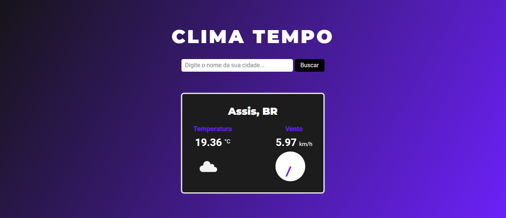

<h1 align="center"> Clima Tempo </h1>

Projeto desenvolvido para consultar as condições climáticas de qualquer cidade do planeta. 

 

  

## 🚀 Tecnologias

Esse projeto foi desenvolvido com as seguintes tecnologias:

- HTML e CSS
- JavaScript
- Git e Github
- API Open Weather

## 💻 Projeto

Desenvolvido para aprimoramento das habilidades voltadas a consumo de APIs, em geral o projeto consiste em consultar as condições climáticas de qualquer cidade, entre essas condições estão: A temperatura, clima, velocidade do vento, direção do vento, entre outros.

## Créditos

Feito por Dário Klein ♥
